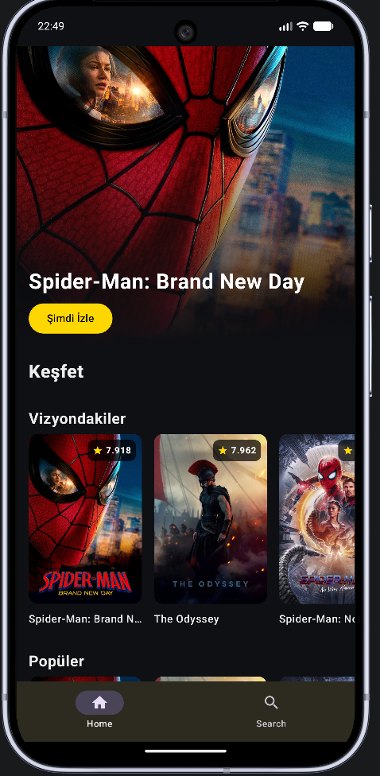
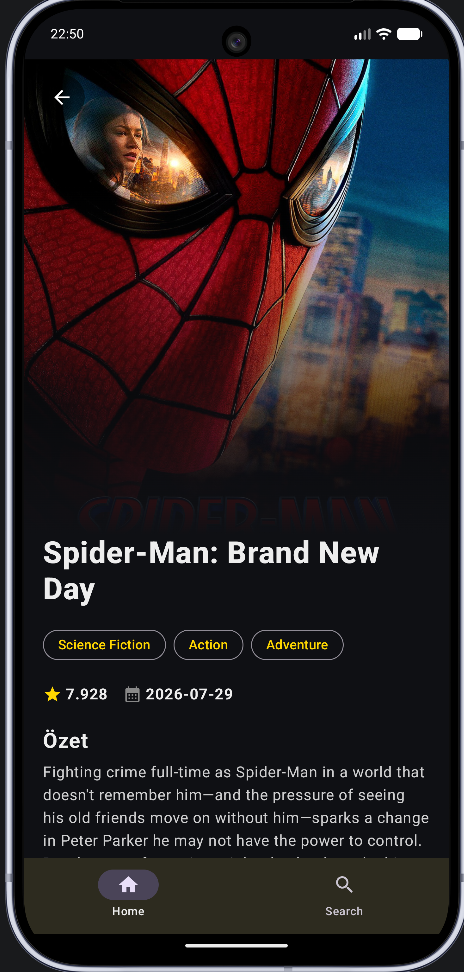
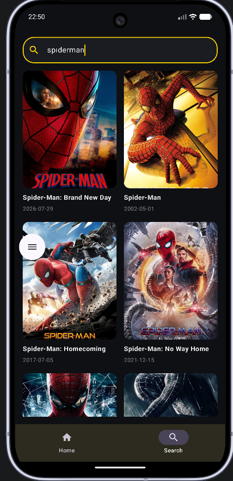

# MovieChallengeApp
🎬 Movie Challenge App
Bu proje, modern Android geliştirme standartlarına uygun olarak geliştirilmiş, TMDB (The Movie Database) API'sini kullanan kapsamlı bir film keşif ve detay uygulamasıdır.

🚀 Kullanılan Teknolojiler ve Mimari
Projede endüstri standardı olan modern mimari bileşenleri ve kütüphaneler tercih edilmiştir:

Dil: Kotlin

Arayüz (UI): Jetpack Compose (Modern ve tamamen deklaratif UI tasarımı)

Mimari Desen: MVVM (Model-View-ViewModel) ve Repository Pattern

Bağımlılık Enjeksiyonu (DI): Dagger Hilt

Ağ İstekleri (Networking): Retrofit & Gson

Görsel Yükleme (Image Loading): Coil

Sayfa Yönlendirme: Jetpack Navigation Compose

✨ Özellikler
Ana Sayfa: Vizyondaki, popüler, en çok oy alan ve yakındaki filmleri yatay/dikey modern listeler halinde görüntüleme.

Film Arama: Anlık arama çubuğu ile dilediğin filmi hızlıca bulabilme.

Detay Sayfası: Filmlere tıklandığında afiş görseli, IMDB puanı, çıkış tarihi, türler, detaylı özet ve tek tıkla YouTube fragmanına yönlendirme özelliği.

Tam Türkçe Arayüz: Kullanıcı dostu ve tamamen yerelleştirilmiş modern tasarım.

⚙️ Kurulum ve Çalıştırma
Bu projeyi klonlayın veya indirin:

Bash
git clone https://github.com/Abdullah-web-hub/MovieChallengeApp.git
Projeyi Android Studio ile açın.

TMDB Developer üzerinden ücretsiz bir v3 API Key alın.

HomeViewModel, SearchViewModel ve DetailViewModel dosyaları içerisinde bulunan apiKey değişkenine kendi API anahtarınızı ekleyin:

Kotlin
private val apiKey = "BURAYA_API_KEY_INIZI_YAZIN"
Projeyi bir Android Emülatöründe (veya fiziksel cihazda) çalıştırın.

### 📱 Uygulama Ekran Görüntüleri

| Ana Sayfa | Detay Sayfası | Arama Ekranı |
| :---: | :---: | :---: |
|  |  |  |
